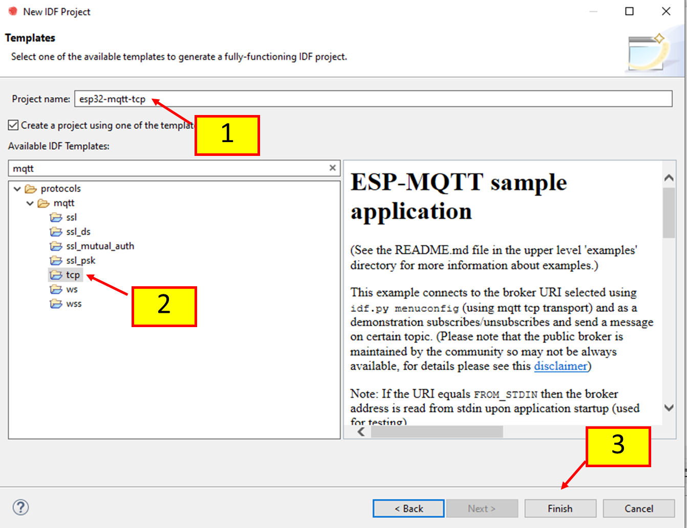

# MQTT_Lab_I
การทดลอง MQTT ตอนที่ 1  การใช้ ESP32 เป็น MQTT Subscriber

# 1. การทดลอง

## 1.1 กำหนด requirement และ scenario ของโปรเจค

การทดลองนี้ จะใช้ ESP32 ในการทำหน้าที่ subscriber ไปยัง MQTT BROKER โดยสมมติว่าเราใช้ ESP32 ควบคุมหลอดไฟฟ้าในบ้าน (ใช้ LED1 เป็นตัวแสดงผล)
การควบคุมหลอดไฟในบ้าน จะทำได้ 2 กรณีคือ สั่งการจาก MQTT Explorer และ MQTT Dashboard

ในการทดลองนี้เราจะใช้ MQTT BROKER  สาธารณะ  เนืองจากไม่จำเป็นต้องมีการตอบสนองแบบทันทีทันใดเหมือน Broker ส่วนตัว

ดังนั้นให้ตั้งชื่อ topic ของแต่ละคนเป็น MYHOME-<nnn> โดย <nnn> คือเลขสามตัวท้ายของรหัสนักศึกษา


## 1.2 สร้าง Project

### 1.2.1 สร้าง project ใหม่จากเทมเพลต `MQTT` -> `tcp`


### 1.2.2 ตั้งชื่อ `esp32-mqtt-tcp`




#### (อธิบายว่าทำอะไร๗

(1)  ................

(2)  ................

(3)  ................

### 1.2.3 ตรวจสอบ code
esp-idf  จะสร้าง code  เบื้องต้นมาให้ ให้ศึกษา code ให้เข้าใจ

```c
...
void app_main(void)
{
    ...

    ESP_ERROR_CHECK(nvs_flash_init());
    ESP_ERROR_CHECK(esp_netif_init());
    ESP_ERROR_CHECK(esp_event_loop_create_default());

    /* This helper function configures Wi-Fi or Ethernet, as selected in menuconfig.
     * Read "Establishing Wi-Fi or Ethernet Connection" section in
     * examples/protocols/README.md for more information about this function.
     */
    ESP_ERROR_CHECK(example_connect());

    mqtt_app_start();
}
```

จากโปรแกรมต้วอย่าง นักศึกษาจะไม่เห็น function ที่ main() เรียกใช้ ซึ่ง function เหล่านั้นจะถูกดึงเข้ามาในขั้นตอนการ build ซึ่งสามารถเปิดไฟล์  CMakeList.txt ใน root ของ project ดูได้ว่า esp-idf เอามาจากที่ไหน

``` cmake
# The following four lines of boilerplate have to be in your project's CMakeLists
# in this exact order for cmake to work correctly
cmake_minimum_required(VERSION 3.5)

# (Not part of the boilerplate)
# This example uses an extra component for common functions such as Wi-Fi and Ethernet connection.
set(EXTRA_COMPONENT_DIRS $ENV{IDF_PATH}/examples/common_components/protocol_examples_common)

include($ENV{IDF_PATH}/tools/cmake/project.cmake)
project(mqtt_tcp)

```

จากตัวอย่างพบว่า example นั้นอยู่ในที่ตั้งดังนี้

```cmake
set(EXTRA_COMPONENT_DIRS $ENV{IDF_PATH}/examples/common_components/protocol_examples_common)
```

### 1.2.4  Build project เพื่อให้ esp-idf ดึง component ต่างๆ มาไว้ใร working area


(1) .....................

(2) .....................

### 1.2.5  ตรวจสอบไฟล์ที่ดึงเข้ามาในขณะที่มีการ build 


ถ้า double click ที่ชื่อไฟล์ในโฟลเดอร์ `protocol_example_common` ก็จะเห็น cocd ในไฟล์นั้น ๆ

(1) .....................

(2) .....................

(3) .....................

## 1.3 กำหนดค่า configuration

### 1.3.1 ตั้งค่า mqtt broker location (URL)


(1) double click ไฟล์ `sdkconfig`

(2) เลือก `Example Configuration`

(3) กำหนด url ของ mqtt broker เป็น `mqtt://mqtt.eclipseprojects.io`

### 1.3.2 ตั้งค่า WiFi SSID และ password


(1) เลือก `Example Connection Configuration`

(2) กำหนด WiFi SSID และ password

### 1.3.3 ปิดไฟล์ SDK Configuration, กด Save เพื่อบันทึกการเปลี่ยนแปลงไปใช้งาน


## 1.4 แก้ไข code ให้ทำงานกับ MQTT Topics ที่ต้องการ

ในฟังก์ขัน void app_main(void)

```c
void app_main(void)
{
    ...
    ESP_ERROR_CHECK(nvs_flash_init());
    ESP_ERROR_CHECK(esp_netif_init());
    ESP_ERROR_CHECK(esp_event_loop_create_default());

    ESP_ERROR_CHECK(example_connect());

    mqtt_app_start();  //<< กด ctrl+click เพื่อตามไปที่ฟังก์ชัน
}
```
กด ctrl+click ที่ `mqtt_app_start();` เพื่อตามไปที่ฟังก์ชัน

```c
void app_main(void)
{
    ...
static void mqtt_app_start(void)
{
    esp_mqtt_client_config_t mqtt_cfg = {
        .uri = CONFIG_BROKER_URL,
    };

    ...
    
    esp_mqtt_client_handle_t client = esp_mqtt_client_init(&mqtt_cfg);
    /* The last argument may be used to pass data to the event handler, in this example mqtt_event_handler */
    esp_mqtt_client_register_event(client, ESP_EVENT_ANY_ID, mqtt_event_handler, NULL);
    esp_mqtt_client_start(client);
}
}
```

ในบรรทัดที่มี code ต่อไปนี้ จะมีการเรียก function pointer ไปยัง `mqtt_event_handler` (พารามิเตอร์ตัวที่ 3)
 
```c
    esp_mqtt_client_register_event(client, ESP_EVENT_ANY_ID, mqtt_event_handler, NULL);
```

กด ctrl+click ที่ `mqtt_event_handler` เพื่อตามไปที่ฟังก์ชัน

ซึ่งมีรายละเอียดของฟังก์ขันดังต่่อไปนี้

```c
static void mqtt_event_handler(void *handler_args, esp_event_base_t base, int32_t event_id, void *event_data)
{
    ESP_LOGD(TAG, "Event dispatched from event loop base=%s, event_id=%d", base, event_id);
    esp_mqtt_event_handle_t event = event_data;
    esp_mqtt_client_handle_t client = event->client;
    int msg_id;
    switch ((esp_mqtt_event_id_t)event_id) {
    case MQTT_EVENT_CONNECTED:
        ESP_LOGI(TAG, "MQTT_EVENT_CONNECTED");
        msg_id = esp_mqtt_client_publish(client, "/topic/qos1", "data_3", 0, 1, 0);
        ESP_LOGI(TAG, "sent publish successful, msg_id=%d", msg_id);

        msg_id = esp_mqtt_client_subscribe(client, "/topic/qos0", 0);
        ESP_LOGI(TAG, "sent subscribe successful, msg_id=%d", msg_id);

        msg_id = esp_mqtt_client_subscribe(client, "/topic/qos1", 1);
        ESP_LOGI(TAG, "sent subscribe successful, msg_id=%d", msg_id);

        msg_id = esp_mqtt_client_unsubscribe(client, "/topic/qos1");
        ESP_LOGI(TAG, "sent unsubscribe successful, msg_id=%d", msg_id);
        break;
    case MQTT_EVENT_DISCONNECTED:
        ESP_LOGI(TAG, "MQTT_EVENT_DISCONNECTED");
        break;

    case MQTT_EVENT_SUBSCRIBED:
        ESP_LOGI(TAG, "MQTT_EVENT_SUBSCRIBED, msg_id=%d", event->msg_id);
        msg_id = esp_mqtt_client_publish(client, "/topic/qos0", "data", 0, 0, 0);
        ESP_LOGI(TAG, "sent publish successful, msg_id=%d", msg_id);
        break;
    case MQTT_EVENT_UNSUBSCRIBED:
        ESP_LOGI(TAG, "MQTT_EVENT_UNSUBSCRIBED, msg_id=%d", event->msg_id);
        break;
    case MQTT_EVENT_PUBLISHED:
        ESP_LOGI(TAG, "MQTT_EVENT_PUBLISHED, msg_id=%d", event->msg_id);
        break;
    case MQTT_EVENT_DATA:
        ESP_LOGI(TAG, "MQTT_EVENT_DATA");
        printf("TOPIC=%.*s\r\n", event->topic_len, event->topic);
        printf("DATA=%.*s\r\n", event->data_len, event->data);
        break;
    case MQTT_EVENT_ERROR:
        ESP_LOGI(TAG, "MQTT_EVENT_ERROR");
        if (event->error_handle->error_type == MQTT_ERROR_TYPE_TCP_TRANSPORT) {
            log_error_if_nonzero("reported from esp-tls", event->error_handle->esp_tls_last_esp_err);
            log_error_if_nonzero("reported from tls stack", event->error_handle->esp_tls_stack_err);
            log_error_if_nonzero("captured as transport's socket errno",  event->error_handle->esp_transport_sock_errno);
            ESP_LOGI(TAG, "Last errno string (%s)", strerror(event->error_handle->esp_transport_sock_errno));

        }
        break;
    default:
        ESP_LOGI(TAG, "Other event id:%d", event->event_id);
        break;
    }
}
```
ฟังก์ชันดันกล่าว จะถูกเรียกขึ้นมาทำงานเมื่อมีเหตุการณ์ใดๆ เกี่ยวกับ MQTT เกิดขึ้น เช่น

|ชื่อ event| รายละเอียด|   
|--|--|
|   MQTT_EVENT_CONNECTED |connected event, additional context: session_present flag|
|   MQTT_EVENT_DISCONNECTED | disconnected event |
|   MQTT_EVENT_SUBSCRIBED | subscribed event, additional context: <br> - msg_id:&emsp;message id<br>- data:&emsp;pointer to the received data<br> - data_len:&emsp;length of the data for this event |
|   MQTT_EVENT_UNSUBSCRIBED |  |
|   MQTT_EVENT_PUBLISHED |  |
|   MQTT_EVENT_DATA |  |
|   MQTT_EVENT_ERROR |  |


## 1.5 ทดสอบการทำงาน 


## 1.6 วิเคราะห์และสรุปผล 


## <<<บันทึกผลที่ได้>>> 


##  [>> หัวข้อต่อไป >>](./MQTT_Sheet_lab_2.md) 